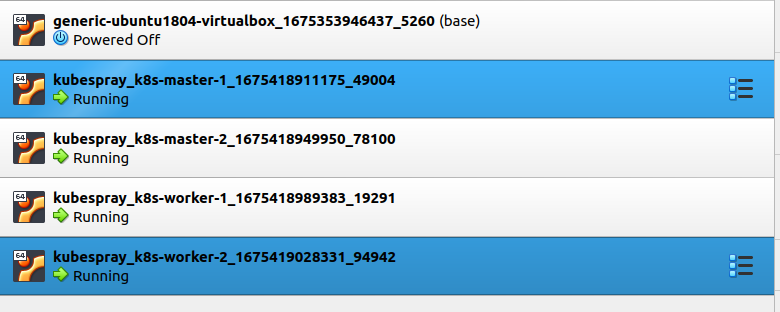

Fork the [Kubespray repo](https://github.com/kubernetes-sigs/kubespray)

After that clone the forked repo

```
git clone <YOUR-FORKED-REPO>
cd kubespray
```

Install ansible and other requirements

```
sudo pip install -r requirements.txt
```

You can check `Vagrantfile`. The `Vagrantfile` is the config for create virtual machine in Virtualbox. Now edit the Vagranfile so the file will looks like this.(just delete the default code and crate the new one).

```
Vagrant.configure("2") do |config|
  config.vm.box = "hashicorp/bionic64"
  config.vm.box_check_update = false
  
  (1..2).each do |i|
    config.vm.define "k8s-master-#{i}" do |node|
      node.vm.hostname = "k8s-master-#{i}"
      node.vm.network "private_network", ip: "192.168.33.10#{i}"
      node.vm.provider "virtualbox" do |v|
        v.memory = 2048
        v.cpus = 2
      end
    end
  end
  (1..2).each do |i|
    config.vm.define "k8s-worker-#{i}" do |node|
      node.vm.hostname = "k8s-worker-#{i}"
      node.vm.network "private_network", ip: "192.168.33.20#{i}"
      node.vm.provider "virtualbox" do |v|
        v.memory = 2048
        v.cpus = 2
      end
    end
  end
end
```

Deploy using vagrant command and it will create the nodes on the virtualbox

```
vagrant up
```

Wait until vagrant finish provision the nodes. It will takes around 15 minutes. After that you can check on your virtualbox or run `vagrant status` command. The first on virtual machine is the base for the other virtual machine. That's how vagrant work.




And add thess lines to `etc/hosts`

```
k8s-master-1 192.168.33.101
k8s-master-2 192.168.33.102
k8s-worker-1 192.168.33.201
k8s-worker-2 192.168.33.202
```
after that copy your ssh-key to all nodes, if you dont have key, generate it first
```
ssh-copy-id <node-ip>
```

Then edit `inventory/mycluster/inventory.ini` just likes below

```
[all]
 node1 ansible_host=192.168.33.101   ip=192.168.33.101 etcd_member_name=etcd1
 node2 ansible_host=192.168.33.102   ip=192.168.33.102 etcd_member_name=etcd2
 node3 ansible_host=192.168.33.201   ip=192.168.33.201 
 node4 ansible_host=192.168.33.202   ip=192.168.33.202
[kube_control_plane]
 node1
 node2

[etcd]
 node1

[kube_node]
 node3
 node4
[k8s_cluster:children]
kube_control_plane
kube_node
```

then run the playbook to install the cluster

```
ansible-playbook -i inventory/mycluster/inventory.ini --become --become-user=root cluster.yml
```

Wait until the installation finish. It will takes time arount 15 minutes. 

After installation is finish, let's try to access and getting nodes inforamtion using kubectl. First ensure you already install [kubectl](https://kubernetes.io/docs/tasks/tools/install-kubectl-linux/)


Then follow these command so we can access the nodes using kubectl

```
mkdir ~/.kube
sudo cp /etc/kubernetes/admin.conf ~/.kube/config
sudo chown $(id -u):$(id -g ) ~/.kube/config
```

Now we have done to set up kubernetes cluster and let's verify with run this command

```
kubectl get nodes
```


#Pods

Pods are the fundamental compute unit in Kubernetes. A Pod is analogous to a container but with some key differences. Pods can contain multiple containers, each of which share a context. The entire Pod will always be scheduled onto the same node. The containers within a Pod are tightly coupled so you should create a new Pod for each distinct part of your application, such as its API and database.

In simple situations, Pods will usually map one-to-one with the containers your application runs. In more advanced cases, Pods can be enhanced with init containers and ephemeral containers to customize startup behavior and provide detailed debugging.

## How to create a pod

You can create a pod using a command like this command:

```
kubectl run nginx --image nginx:latest
```

You can also create it by using a manifest by a yaml file, looks like config below

```
apiVersion: v1
kind: Pod
metadata:
  name: nginx
spec:
  containers:
  - name: nginx
    image: nginx:latest
    ports:
    - containerPort: 80
```

And execute it wit command

```
kubectl apply -f file-demo/simple-pod.yaml
```

## To list the pod

To get the list of the pod you can easily run this command

```
kubectl get pod
NAME    READY   STATUS    RESTARTS   AGE
nginx   1/1     Running   0          36s

```

## Remove pod

To remove the pod you can execute this command

```
kubectl delete pods nginx
```

or via the yaml file

```
kubectl delete -f simple-pod.yaml
```

if you run `kubectl get pods` you will get the pod removed

```
kubectl get pod
No resources found in default namespace.
```